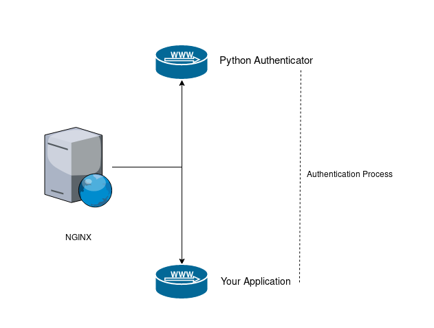

# oauth-proxy

## Architecture
 

### Nginx
Responsible to communicate with the authenticator and your application

### Authenticator
It's a flask python application responsible to authenticate the user with google account. This application has two endpoints:
- `/login` - Responsible to render a button to open the Google Authentication web page.
- `/auth` - Responsible to validate the user authentication.

## Configuration
To make this server works you need to create a configuration file named `conf.yaml` with the following content:
```
google-oauth:
  - client_id: "[REDACTED].apps.googleusercontent.com"
    client_secret: "[REDACTED]"
    redirect_uri: "http://your-application.yourdomain.com/auth"
    emails: []
    domains: ["yourdomain.com"]
```
Here's an explanation of each attributes:
- `client_id` and `client_secret` are responsible to authenticate the user on google, you can get this tokens on the this [link](https://console.developers.google.com/apis/credentials).
- `redirect_uri` is the url which Google will redirect you after the authentication process.
- `emails` this is a list of allowed e-mails to access your application.
- `domains` this is a list of allowed domains to access your application.

## Build
To build the docker images from this project run the following commands: 
 - `cd nginx && docker build -t nginx-authenticator && cd ..`
 - `cd app && docker build -t authenticator && cd ..`


## Examples
You can find examples on [examples/](examples/)